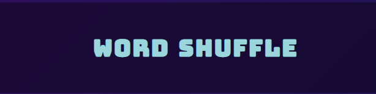
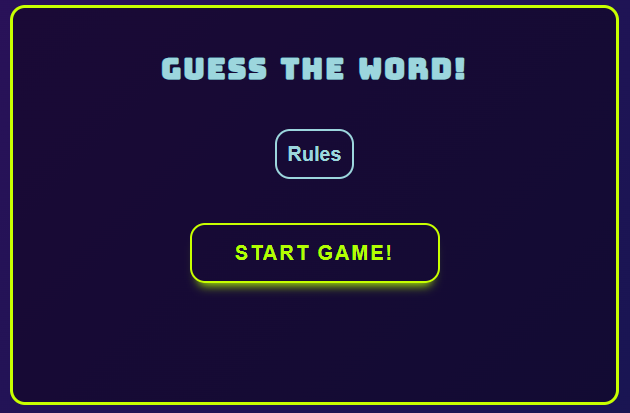
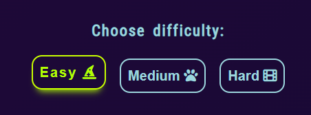
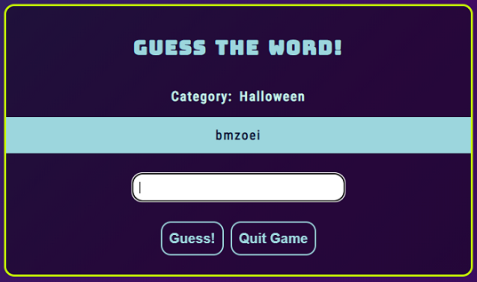
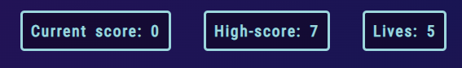
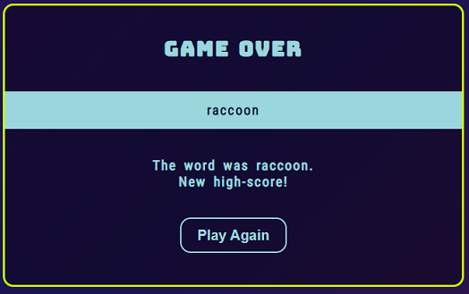
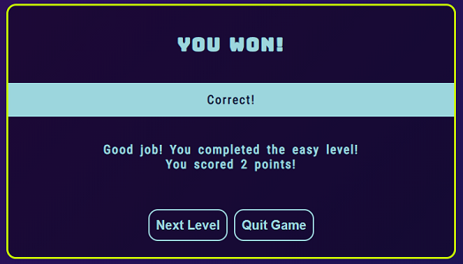

# Word Shuffle

World Shuffle is a simple game that tickles the brain of the user by taking a word and shuffle around the letters.
While the game itself is quite simple, the task of solving what word it is might be more challenging than you'd think.
The user will get to choose between three difficulties, where each difficulty is tied to a specific category and contains
15 words.
A word will be randomly picked for the user to guess and each correct word will provide a point, and if the 
user guesses all words correctly in one difficulty, that level will be cleared.
The goal of the game is to score as many points as possible, if the user guesses wrong five times, the game will be over!

- - - 

## Table of Contents

* [Features](#features)
    * [Existing Features](#existing-features)
    * [Future Features](#future-features)
* [Testing](#testing)
    * [Validator Testing](#validator-testing)
    * [Bugs](#bugs)
    * [Unsolved Bugs](#unsolved-bugs)
* [Technologies Used](#technologies-used)
  * [Main Languages](#main-languages)
  * [Frameworks, Libraries & Programs](#frameworks-libraries--programs)
* [Deployment](#deployment)
* [Credits](#credits)
  * [Code](#code)

  
- - - 

## Features

### Existing Features

#### Header

  * Is a simple heading featured at the top of the page that tells the name of the game.

#### Start Area

  * Is simple but clear and provides the user with two interactive buttons.
  * The start game button will initiate the game and take the user to the game options.
  * The rules button will provide the user with information of how to play the game in a pop-up window when clicked.

#### The game options

  * The game options lets the user choose from different difficulties which includes: easy(contains 4-5 letters in each word), medium(6-7 letters) and hard(8-9) letters.
  * This section provides the user with interactive buttons that the user can click to choose difficulty and start the game.

#### Playing the game

  * This section appears once the user have chosen a difficulty, and informs the user what category the words are tied to,
  a box containing the shuffled word, a input for the user to type their answer, and a interactive button that lets the user 
  submit their answer.
  * The input features an auto focus so that the user don't have to click on the input window everytime they want to type
  in a guess, users are also able to press the Enter key instead of clicking on the guess button for convinience.

#### Score and life 

  * Is provided underneath the main game area and lets the user know what their current score is, what their highscore is and how many lives they have left.

#### The game results

  * If the user reaches 0 life, the game will be over and a message will be displayed on screen and makes it clear to the user what the correct answer was, what score they ended up with and if they set a new high-score.
  * A button will also be provided for the user to allow them to play again, and restarts the game.
  
  * If the user clears a difficulty or wins the game by clearing all the difficulties a congratulatory message will be displayed and let them know if a new high-score has been set.
  * Here the user will be provided with two interactive buttons that lets them either continue to the next difficulty or quit the game.

### Future Features
  * I would like to implement more categories and maybe a feature that would allow the user to choose category.
  * Or if the user has cleared all the difficulties, add a new category to each difficulty.

---

## Testing

### Lighthouse Testing

#### Index Page

#### Application Page

### Validator Testing

#### CSS

#### HTML

### Bugs

#### 
  * **Expected** - 
  * **Testing** - 
  * **Result** - 
  * **Fix** - 

  #### 
  * **Expected** -
  * **Testing** - 
  * **Result** - 
  * **Fix** - 

  #### 
  * **Expected** - 
  * **Testing** - 
  * **Result** - 
  * **Fix** - 

### Unsolved bugs
 
---

## Technologies Used

### Main Languages
  * HTML5
  * CSS3
  * JavaScript

### Frameworks, Libraries & Programs
  * [Google Fonts](https://fonts.google.com/) - To find and import fonts used on the website
  * [GitHub](https://github.com/) - To save and store files for the website.
  * Git - For version control.
  * Vistual Studio Code(desktop) - For testing and experimenting with code and different layouts. 

---

## Deployment

This website was deployed to GitHud pages.The steps to deploy are as follows:
  * In the GitHub repository, navigate to the Settings tab
  * From the source section drop-down menu, select the Master Branch
  * Once the master branch has been selected, the page will be automatically   refreshed with a detailed ribbon display to indicate the successful deployment.

  The live link can be found here: 

---

## Credits

### Code

I took inspiration from these two codepens in particular to help me build this game:
  * https://codepen.io/aguscoppe/pen/oNbwYZg
  * https://codepen.io/anandvikas/pen/RwxKagb

CSS styles for buttons and the animated background was inspired from:
  * https://codepen.io/P1N2O/pen/pyBNzX
  * https://codepen.io/giana/pen/BZaGyP
   
   In general:
  * [Stackoverflow](https://stackoverflow.com/) has been a huge help for finding solutions when I've been stuck on coding problems or if wanted to create something specific but didn't know how to.

### Content
