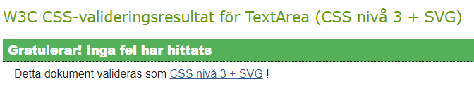

# Word Shuffle

World Shuffle is a simple game that tickles the brain of the user by taking a word and shuffle around the letters.
While the game itself is quite simple, the task of solving what word it is might be more challenging than you'd think.
The user will get to choose between three difficulties, where each difficulty is tied to a specific category.
A word will be randomly picked for the user to guess and each correct word will provide a point, and if the 
user guesses 8 words correctly, that level will be cleared.
The goal of the game is to score as many points as possible, if the user guesses wrong five times, the game will be over!

- - - 

## Table of Contents

* [Features](#features)
    * [Existing Features](#existing-features)
    * [Future Features](#future-features)
* [Testing](#testing)
    * [Validator Testing](#validator-testing)
    * [Bugs](#bugs)
    * [Unsolved Bugs](#unsolved-bugs)
* [Technologies Used](#technologies-used)
  * [Main Languages](#main-languages)
  * [Frameworks, Libraries & Programs](#frameworks-libraries--programs)
* [Deployment](#deployment)
* [Credits](#credits)
  * [Code](#code)

  
- - - 

## Features

### Existing Features

#### Header

  * Is a simple heading featured at the top of the page that tells the name of the game.

#### Start Area

  * Is simple but clear and provides the user with two interactive buttons.
  * The start game button will initiate the game and take the user to the game options.
  * The rules button will provide the user with information of how to play the game in a pop-up window when clicked.

#### The game options

  * The game options lets the user choose from different difficulties which includes: easy(contains 4-5 letters in each word), medium(6-7 letters) and hard(8-10) letters.
  * This section provides the user with interactive buttons that the user can click to choose difficulty and start the game.

#### Playing the game

  * This section appears once the user have chosen a difficulty, and informs the user what category the words are tied to,
  a box containing the shuffled word, a input for the user to type their answer, and a interactive button that lets the user 
  submit their answer.
  * The input features an auto focus so that the user don't have to click on the input window everytime they want to type
  in a guess, users are also able to press the Enter key instead of clicking on the guess button for convinience.

#### Score and life 

  * Is provided underneath the main game area and lets the user know what their current score is, what their highscore is and how many lives they have left.

#### The game results

  * If the user reaches 0 life, the game will be over and a message will be displayed on screen and makes it clear to the user what the correct answer was, what score they ended up with and if they set a new high-score.
  * A button will also be provided for the user to allow them to play again, and restarts the game.
  
  * If the user clears a difficulty a congratulatory message will be displayed and let them know if a new high-score has been set.
  * Here the user will be provided with two interactive buttons that lets them either continue to the next difficulty or quit the game.

### Future Features
  * I would like to implement more categories and maybe a feature that would allow the user to choose category.
  * Or if the user has cleared all the difficulties, add a new category to each difficulty.
  * A board to display previous high-scores.

---

## Testing

Testing was ongoing throughout the entire build, Chrome Developers Tools was actively used for debugging and to check for, identify and resolve problems. I have also used Chrome Dev tools device toolbar to check responsiveness on different screen sizes, which I will say is okay but not perfect on the smaller screen sizes. I have tested the website on my phone and in the following browsers without noticing any issues:
  * Chrome
  * Mozilla Firefox
  * Microsoft Edge
  * Safari on iPad Air

### Lighthouse Testing

  * I used Lighthouse in Chrome Dev tools to test performance, accessibility, best practices and SEO.

### Validator Testing

W3C was used to validate html code on all pages and the CSS code. The css code was approved on first check, some end trailing slashes had to be removed from html to pass.

#### CSS

#### HTML

### Bugs

#### Text on button moves when resizing window
  * **Expected** - for the text on the button to stay in one place, centered inside button at all screen sizes
  * **Testing** - launched website through terminal to see appearance, tried removing and adding different css styles in Chrome dev tools
  * **Result** - by turning css elements on and off in chrome dev tools i eventually found out that percentage values
                 on some elements were the cause of this
  * **Fix** - by adding a main div to wrap around the game area and changing the percentage values
affecting the text to pixels 

  #### Highscore doesn't update properly
  * **Expected** - for high-score to update when playing through multiple difficulties
  * **Testing** - launched website through terminal, tried debugging through chrome dev tools console to find the issue, edited code and moved it around
  * **Result** - highscore only updated if you played one difficulty, but it you started on easy and continued to medium, highscore wouldnt update
  * **Fix** - removed parseInt on checkScore function then it worked

  #### Next level button is not hidden when playing hard level
  * **Expected** - to have next level button hidden when playing on hard mode
  * **Testing** - launched website through terminal, tried debugging through chrome dev tools console to find the issue, tested adding hidden classlist with alot of different statements and conditions
  * **Result** - the button wouldn't refused to go away, it would still appear on hard level but it would disappear if it was clicked 
  * **Fix** - added nextLvlBtn.style.display = "none" instead in the startGame function

### Unsolved bugs
 
---

## Technologies Used

### Main Languages
  * HTML5
  * CSS3
  * JavaScript

### Frameworks, Libraries & Programs
  * [Fontawesome](https://fontawesome.com/) - For adding icons.
  * [Google Fonts](https://fonts.google.com/) - To find and import fonts used on the website. [Bungee](https://fonts.google.com/specimen/Bungee?query=bungee) and [Roboto Condensed](https://fonts.google.com/specimen/Roboto+Condensed?query=roboto) were the fonts I used for this project.
  * [GitHub](https://github.com/) - To save and store files for the website.
  * Git - For version control.
  * Vistual Studio Code(desktop) - For testing and experimenting with code and different layouts. 
  * [Am I Responsive?](https://ui.dev/amiresponsive) - To display website on different devices.

---

## Deployment

This website was deployed to GitHud pages.The steps to deploy are as follows:
  * In the GitHub repository, navigate to the Settings tab
  * From the source section drop-down menu, select the Master Branch
  * Once the master branch has been selected, the page will be automatically   refreshed with a detailed ribbon display to indicate the successful deployment.

  The live link can be found here: https://stockman-jr.github.io/Word-Shuffle-Game/

---

## Credits

### Code

I took inspiration from these two codepens in particular to help me build this game:
  * https://codepen.io/aguscoppe/pen/oNbwYZg
  * https://codepen.io/anandvikas/pen/RwxKagb

CSS styles for buttons and the animated background was inspired from:
  * https://codepen.io/P1N2O/pen/pyBNzX
  * https://codepen.io/giana/pen/BZaGyP

For the modal I followed W3Schools tutorial:
  * https://www.w3schools.com/howto/howto_css_modals.asp
   
   In general:
  * [Stackoverflow](https://stackoverflow.com/) has been a huge help for finding solutions when I've been stuck on coding problems or if wanted to create something specific but didn't know how to.

